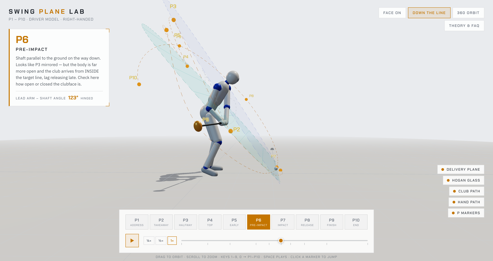

# Swing Plane Lab

An interactive 3D golf swing viewer for learning the swing plane and the P1–P10 position system. A porcelain mocap-style mannequin swings a driver through all ten classic checkpoints — scrub anywhere in between, orbit around him like a car walkaround, and study the geometry that coaches actually check.

Built with [Three.js](https://threejs.org/). Single HTML file, no build step.

**▶ Try it live: [deepuasok.github.io/swing-plane-lab](https://deepuasok.github.io/swing-plane-lab/)**



## Run it

```bash
./run.sh
```

Serves the folder on `localhost:8794` and opens the browser. Or open `index.html` from any static server.

## What it shows

- **P1–P10 positions** (HackMotion P Classification System), each calibrated against reference stills from [The DIY Golfer](https://www.thediygolfer.com/swing-positions/) and validated checkpoint by checkpoint: shaft parallel at P2/P4/P6/P8, lead-arm parallel at P3/P5, trail-arm parallel at P9, straight lead arm P1–P8, full extension at P8.
- **Two swing planes** — the teal *delivery plane* (~48°) the club rides through impact, and *Hogan's glass* (~62°, computed from the mannequin's own ball-to-shoulder geometry per *Five Lessons*): the backswing ceiling. The gap between them is "the slot."
- **The real club path** — a dotted trace of the actual swing loop (wide takeaway, narrow at the top, delivered from inside), not an idealized circle.
- **Live wrist-hinge readout** — lead arm–shaft angle updating as you scrub: ~150° at address → ~83° fully hinged at the top → lag held through P6 → ~148° released at impact.
- **Biomechanics** — hips-lead spine spiral, hip bump and lead-leg posting in transition, pelvic roll driving per-leg knee flex, trail elbow tucked (never flying), quiet head that releases to watch the ball flight.

## Controls

| Control | Action |
|---|---|
| P1–P10 buttons, keys `1`–`9`, `0` | Jump to a position (animated) |
| Timeline slider | Scrub continuously through the swing |
| `Space` | Play / pause (¼×, ½×, 1× speeds) |
| Drag / scroll | Orbit (locked to walkaround height) and zoom |
| Camera presets | Face On, Down the Line, 360 auto-orbit |
| Toggles | Delivery plane, Hogan glass, club path, hand path, P markers |
| Theory & FAQ | In-app explainer: the planes, the slot, lag, over-the-top, the P system |

## How it works

- All 10 positions are keyframes (`KEYS` array): exact grip position + shaft direction, hip/shoulder turn, spine bend, side bend, lateral shift, heel lift, squat depth, pelvic roll, gaze, and per-key IK elbow hints.
- Non-uniform Catmull-Rom interpolation with per-key tension — keyframe spacing encodes tempo (slow backswing, fast strike, pause at the top).
- Two-bone soft-IK solves elbows and knees; the clubhead trace and both planes derive from the model itself.
- `viewer.audit()` in the console checks every position's invariants (arm straightness, shaft-parallel checkpoints, under-the-glass, knee flex ranges) — the regression suite that keeps edits honest.

## Roadmap

- Retarget real swing mocap (MediaPipe/BlazePose from video) onto the mannequin for genuinely human velocity profiles
- Fault modes: over-the-top, casting, chicken wing — toggleable "what bad looks like"
- Iron/wedge models (steeper plane, shorter top)
